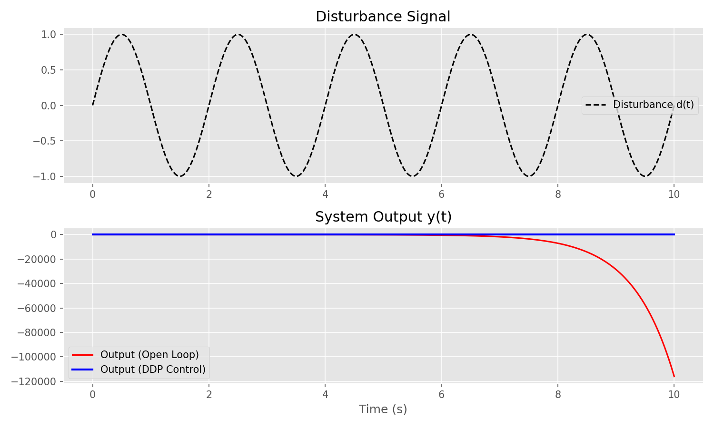

# Isidori : A Web-based Geometric Control Theory Simulator

An educational web application for [Geometric Control Theory](https://www.kth.se/student/kurser/kurs/SF2842?l=en), based on the course SF2842 at KTH.

## Overview

Isidori is designed to explore concepts in Geometric Control Theory, including:
- Invariance and controlled invariance (V*)
- Disturbance decoupling
- Zero dynamics and system inversion
- Tracking and non-interacting control
- Output regulation and the Internal Model Principle
- Nonlinear systems and relative degree

## Syllabus Coverage

This project covers the following topics from the syllabus:
- **Linear Systems**: Controlled invariant subspaces, Disturbance Decoupling Problem (DDP).
- **Nonlinear Systems**: Relative degree, zero dynamics.
- **Simulation**: Time response of systems with disturbances.

## Visualizations



*Example showing output regulation in the presence of disturbances.*

## Getting Started

### Prerequisites

- Python 3.8+
- Node.js 16+

### Installation

1. Clone the repository:
   ```bash
   git clone https://github.com/yourusername/isidori.git
   cd isidori
   ```

2. Create and activate a virtual environment:
   
   Windows:
   ```bash
   python -m venv venv
   .\venv\Scripts\activate
   ```

   macOS/Linux:
   ```bash
   python3 -m venv venv
   source venv/bin/activate
   ```

3. Install Python dependencies:
   ```bash
   pip install -r requirements.txt
   ```

4. Install Node.js dependencies:
   ```bash
   npm install
   ```

### Usage

1. Start the backend server (ensure the virtual environment is activated):
   ```bash
   python api/index.py
   ```

2. Start the frontend development server:
   ```bash
   npm run dev
   ```

3. Open http://localhost:3000 in your browser.

## Testing

Run unit tests:
```bash
pytest tests/unit
```

Run end-to-end tests:
```bash
npm run test:e2e
```

## License

MIT License
